<!-- <h1 align="center">Microwave shushi should be a thing</h1> -->

<!-- <h1 align="center">Hi 👋, I'm Binomial Theorem</h1> -->
<!-- <h3 align="center">Microwave shushi should be a thing</h3> -->

****************************** 

    

  
  

